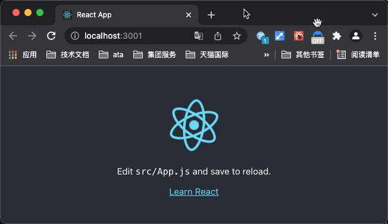

## React源码环境搭建
## 0、参考文章
[react源码学习环境搭建](https://segmentfault.com/a/1190000020239791)  
[搭建源码调试环境](https://github.com/neroneroffy/react-source-code-debug/blob/master/docs/setUpDebugEnv.md)

## 1、基础环境
+ mac:11.6
+ node:14.15.0

## 2、搭建步骤
+ 创建react项目
```
 npx create-react-app react-source-robin
 cnpm i
 npm start
```


+ 暴露配置，多了config/scripts文件夹
```
npm run eject
```
